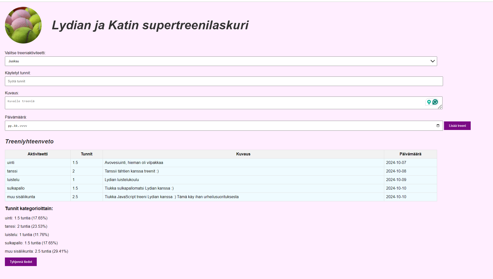

# Projektin nimi
Lydian ja Katin supertreenilaskuri

## Linkki sovellukseen
Pääset supertreenilaskuriimme täältä: 

## Työnjako
Yhteistyömme sujui mutkattomasti ja saimme jaettua tehtävät hyvin ja reilusti.

Työstimme yhdessä JavaScript toimintoja ja viimeistelimme sivun ulkomuodon. Kaiken kaikkiaan teimme projektin pääosin yhdessä miettien. Tapasimme Teamsissa sekä koululla. Koimme tekemisen helpommaksi ns. ”kaksien silmien ja aivojen taktiikalla”. 

## Sisältö:
- [Tiedot sovelluksesta](#Tiedot-sovelluksesta)
- [Kuvia sovelluksesta](#Kuvia-sovelluksesta)
- [Käytetyt menetelmät](#Käytetyt-menetelmät)
- [Sovelluksen käyttö](#Sovelluksen-käyttö)
- [Status](#status)
- [Tekijät ja lähteet](#Tekijät-ja-lähteet)
- [Lisenssi](#Lisenssi)

## Tiedot sovelluksesta
Luomamme sovelluksen nimi on Lydian ja Katin supertreenilaskuri.
Sovelluksemme tarkoitus on pitää kirjaa käyttäjän treeneistä. Sovellukseen voi kirjata mitä lajia on harjoittanut, montako tuntia, lisätä tarkemman kuvauksen treenistä ja merkitä päivämäärän.

Tiedot kirjautuvat Treeniyhteenveto-taulukkoon ja ne pysyvät muuttumattomina niin kauan, kunnes käyttäjä tyhjentää tiedot. 
Taulukon alle, sovellus laskee kategorioittain prosentteina ja tunteina, kuinka paljon mitäkin urheilulajia on harjoitettu. Taulukon voi tyhjentää helposti käyttämällä tyhjennä nappulaa, jolloin ohjelma antaa käyttäjälle ilmoituksen, että olet tyhjentämässä taulukon.

## Kuvia sovelluksesta

## Käytetyt menetelmät
Teknologiat, joita käytimme tämän projektin tekemiseen olivat HTML, CSS sekä Javascript.

HTML:ää käytimme verkkosivun rakenteen ja sisällön luomiseen. Jokainen sovelluksen osa, kuten lomake treenitietojen syöttämiseksi ja taulukko yhteenvetojen näyttämiseksi, on rakennettu HTML-elementeillä. Lisäksi käytimme HTML:ää luomaan painikkeet, kuten "Tyhjennä taulukko" -toiminnon, ja varmistimme, että sivusto on selkeästi jäsennelty ja helppokäyttöinen. 

CSS:ällä määrittelimme sovelluksen tarkemman ulkomuodon, kuten värityksen, elementtien koot, muodot sekä fontit.

JavaScriptillä loimme sovelluksen toiminnallisuudet ja interaktiivisuuden. Se vastaa mm. treenitietojen tallentamisesta ja laskemisesta sekä treeniyhteenvedon päivittämisestä. Käytimme JavaScriptiä seuraaviin toimintoihin:

- Tietojen syöttäminen ja validointi: Käyttäjän syöttämät tiedot, kuten treenin laji ja kesto, tallennetaan taulukkoon.
- Laskenta: Sovellus laskee automaattisesti urheilulajien prosenttijakauman ja yhteistreenimäärät.
- Tiedonhallinta: Treenitietojen poistaminen onnistuu "Tyhjennä" -painikkeella, joka myös varmistaa käyttäjältä, ennen kuin tiedot poistetaan pysyvästi.
- Tiedon tallentaminen: Käytimme JavaScriptin localStorage-ominaisuutta tietojen tallentamiseen, jotta tiedot säilyvät selaimen päivittämisen tai sulkemisen välillä, kunnes käyttäjä päättää tyhjentää ne.

## Sovelluksen käyttö
Alla ohjeet käyttäjälle sovelluksen käyttöönottoon:
- Lataa kaikki tiedostot omalle koneelle 
- Avaa index.html tiedosto haluamallasi selaimella
- Voit joko ladata tai kloonata repositorion 

## Status
Lydian ja Katin supertreenilaskuri on vielä kehitystyön alla. Lisää toiminnallisuuksia tulossa sovelluksen versiossa 2.0, joka julkaistaan pian.

## Tekijät ja lähteet
Sovelluksen kehittivät Lydia Palosaari ja Kati Tuukkanen.

Sovelluksen tekemisessä on käytetty apuna ChatGPT:tä ja CoPilottia.

- ChatGPT auttoi meitä erityisesti ymmärtämään monimutkaisia JavaScript-käsitteitä ja -toimintoja, kuten funktioiden käyttöä, tietojen tallennusta localStorageen sekä taulukkojen dynaamista luomista ja päivittämistä. Kun kohtasimme ongelmia esimerkiksi tietojen laskemisessa ja niiden näyttämisessä oikein käyttöliittymässä, ChatGPT tarjosi selkeitä ratkaisuja ja koodiesimerkkejä, joita pystyimme helposti mukauttamaan projektiimme.

- GitHub Copilot puolestaan tarjosi koodiehdotuksia reaaliajassa ja nopeutti koodin kirjoittamista huomattavasti. Copilotin avulla saimme rakennettua toimintoja nopeammin, kuten automaattisen syöttötietojen validoinnin ja taulukon tietojen tyhjennyksen varoitusviestin kanssa. Copilotin ehdotukset toimivat hyvänä lähtökohtana, joita mukautimme oman projektimme tarpeisiin.

Tekoäly ei pelkästään auttanut ratkaisujen löytämisessä, vaan se myös syvensi ymmärrystämme ohjelmoinnista kokonaisuudessaan. Sen avulla opimme enemmän mm. seuraavista aiheista:

- Funktiot: Miten luoda uudelleenkäytettäviä funktioita, jotka suorittavat toistuvia tehtäviä, kuten tietojen tallentamista ja päivittämistä.
- Taulukot: Ymmärsimme paremmin, miten taulukoiden käsittely toimii JavaScriptissä, esimerkiksi miten lisätä uusia rivejä taulukkoon dynaamisesti käyttäjän syöttämien tietojen perusteella.
- LocalStorage: Opimme, miten localStorage-ominaisuutta voi hyödyntää tietojen tallentamiseen niin, että ne säilyvät selainistuntojen välillä.

## Lisenssi
MIT license

